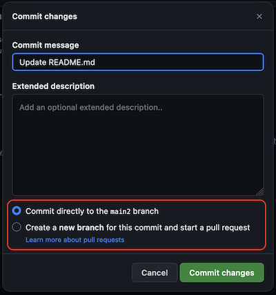
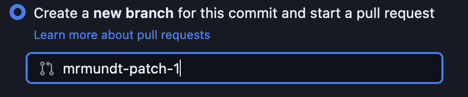
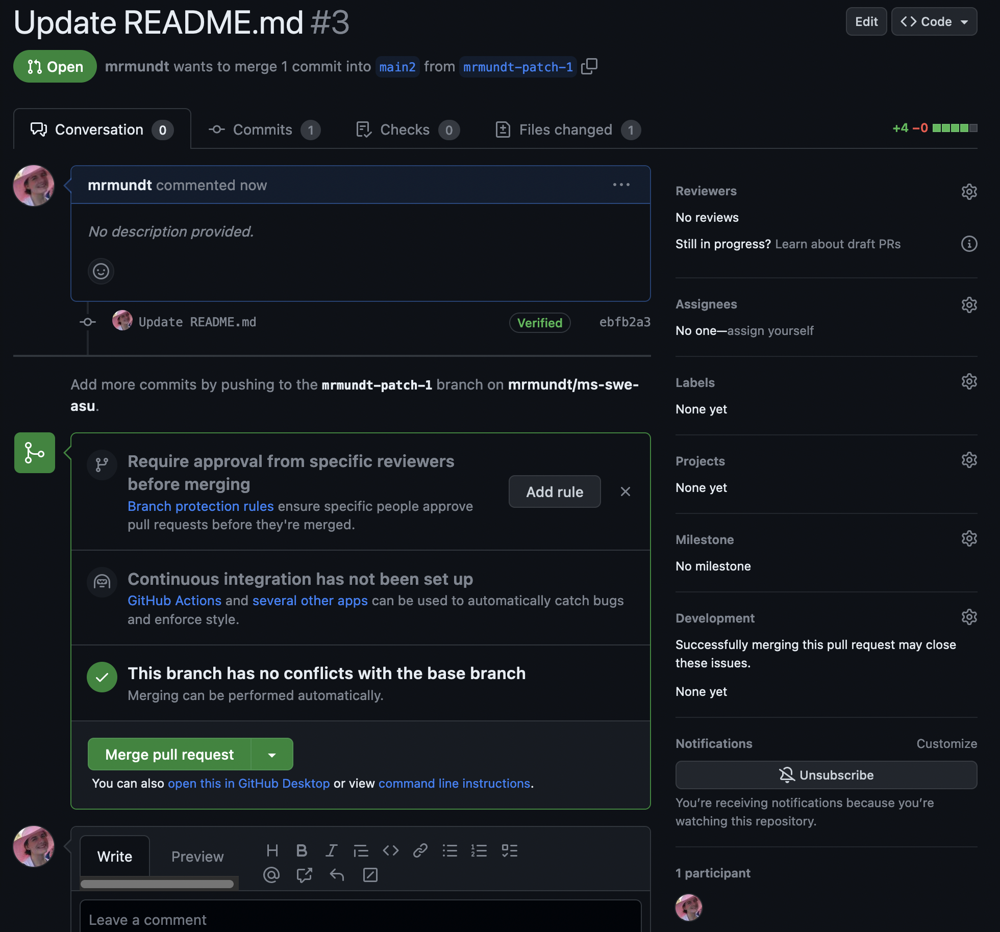
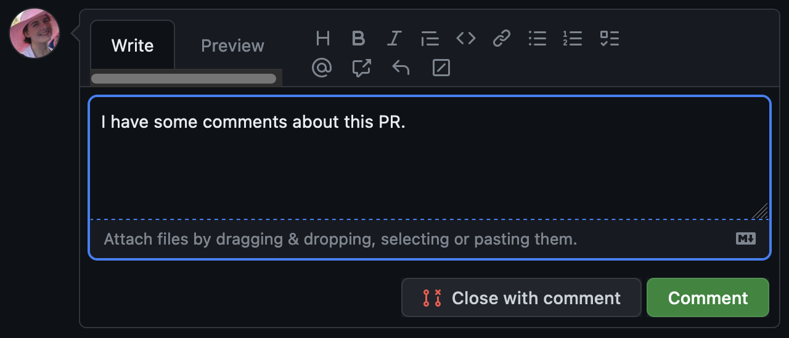
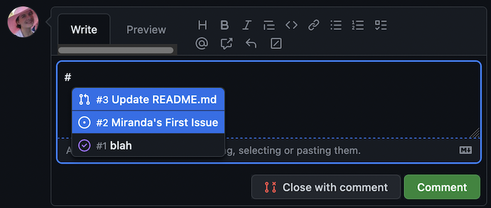
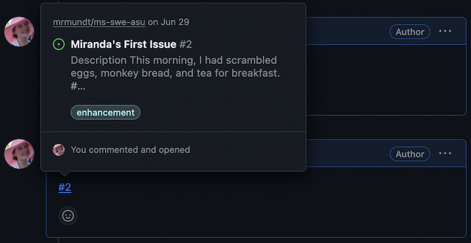
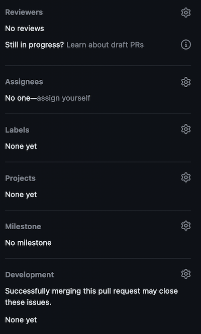
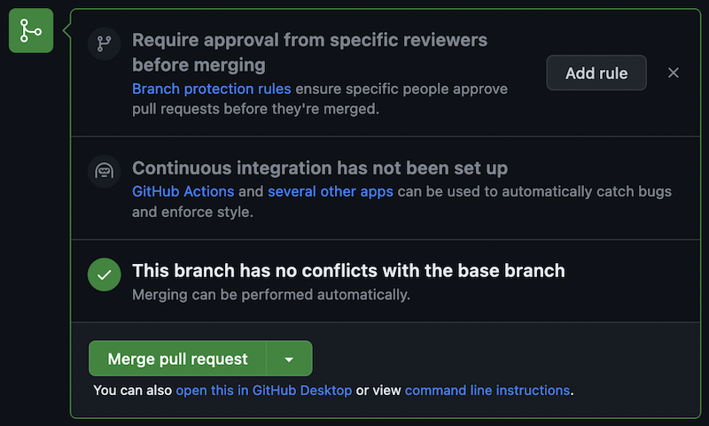
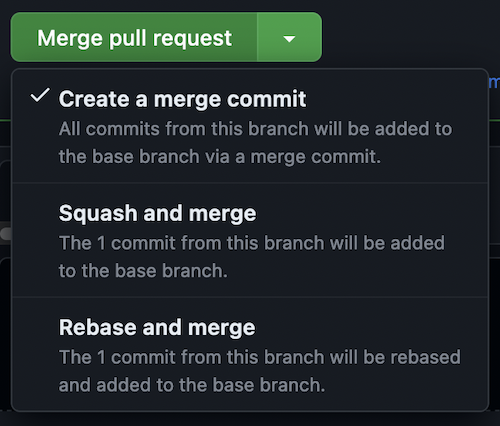
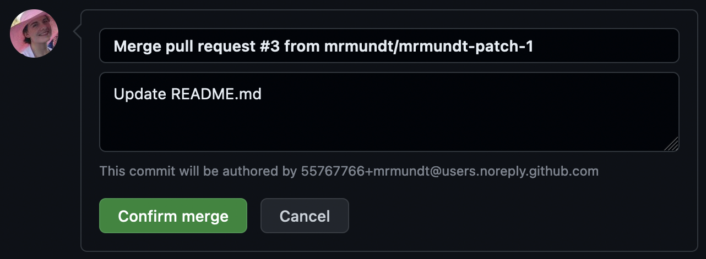

::::::::::::::::::::::::::::::::::::::: objectives

- Recognize what makes a pull request easy to review.
- Become familiar with basic actions on GitHub Pull Requests.

::::::::::::::::::::::::::::::::::::::::::::::::::

:::::::::::::::::::::::::::::::::::::::: questions

- What makes a *good* PR?
- How do you open a PR?
- How do you interact with a PR?
- How do you merge a PR?

::::::::::::::::::::::::::::::::::::::::::::::::::

## What Makes a *Good* PR?

Before we open one, it helps to know what we're aiming for. A PR that's easy (and fast) to
review tends to have the following characteristics:

| Characteristic | In plain terms |
|----------------|----------------|
| **One cohesive change** | A PR should do *one* thing. Don't bundle a bugfix, a rename, and a new feature together — they can't be reviewed or reverted independently. |
| **Reasonable size** | Hundreds of changed lines are miserable to review. If a change is big, split it into smaller PRs. |
| **Descriptive what / how / why** | The title and description should answer: *what* changed, *how* it changed (and side effects), and *why*. |

Keep these in mind for the PR you're about to open — we'll practice spotting violations later.

## Open a PR

A PR cannot be opened without some changes to be incorporated. For this example,
we will use the `branch` and `merge` workflow; however, another common method
is the `fork`, `branch`, and `merge` method.

:::::::::::::::::::::::::::::::::::::::::  callout

## Multiple Paths Available

We will do the rest of this lesson through the GUI; however, all of these
steps can be done via command line and your preferred text editor.
Do whatever feels right for you!

::::::::::::::::::::::::::::::::::::::::::::::::::

### Make a Change

Edit a file in your repository (click the file, then the **Edit** pencil). When you're happy
with it, click **Commit changes…** to open the commit dialog.

{alt='Commit changes pop-up dialog with the sections Commit message, Extended commit message, and the radio option for "Commit directly to `main`" or "Create a new branch" circled'}

Rather than committing directly to `main`, choose **Create a new branch**. GitHub autofills a
branch name, which you can keep or change.

{alt='Commit changes pop-up dialog, zoomed in on the "Create a new branch" radio button when clicked, which defaults a branch name that can be changed'}

### Make a PR

Committing to the new branch loads the **Open a pull request** page, pre-filled with your commit
message as the title. Like an issue, a PR has a **Title**, a **Write** area (Markdown), and a
**Preview**. Fill in the description, then click **Create pull request**.

{alt='Newly opened PR with proposed changes - main page shows the Title, description, list of commits, and merge options'}

:::::::::::::::::::::::::::::::::::::::  challenge

## Open Your StarSort Fix

Time to fix that StarSort bug! In **your practice repository**:

* Make a change to your `README.md` (pretend it's the code that fixes the empty-folder crash).
* Commit it to a **new branch**.
* Open a PR — and write a description with **what / how / why** (use the good-PR table
  above, not just a one-word title!).
* Create the PR.

::::::::::::::::::::::::::::::::::::::::::::::::::

::::::::::::::::::::::::::::::::::::::::::  callout

## GenAI: Draft the description from your diff

Staring at a blank description box? Paste your diff into an LLM and ask for a PR description with
what/how/why sections. It's a fast first draft — but **check it**: the AI can describe *what*
changed from the diff, but only *you* know the *why*. Fix anything that it hallucinated.

::::::::::::::::::::::::::::::::::::::::::::::::::::::

## Interact with a PR

There are many interactions available on an open PR.

The most basic interaction is adding a comment. This is
how you can interact with the PR author, the assignee, and others who
have commented on or subscribed to the PR.

Simply click in the comment box at the bottom of the PR, type whatever
you'd like, and click "Comment."

{alt='Comment box on a Pull Request - Write section includes a statement, "I am writing a comment on this PR"'}

Another useful feature for GitHub is linking Issues and PRs. This is actually
very simple. In the PR's description or in a comment, mention the relevant
Issue using `#` and the Issue number.

{alt='An image using the pound symbol (#) to pop-up options for linking other Issues or Pull Requests'}

This will create a link to the Issue.

{alt='An image showing the pop-up to a linked issue. The pop-up shows a small preview of the linked issue that includes the title and some portion of the description.'}

You can also edit the information in the right-hand column.

{alt='Information block on the right-hand side that includes reviewers, assignees, labels, projects'}

We will cover the following options:

| Options | Purpose |
| ------- | ------- |
| Reviewers | Assign reviewer(s) to look over your proposed changes. |
| Assignees | Add assignee(s) who are responsible for incorporating proposed changes. |
| Labels | Assign label(s) to categorize the PR. |

:::::::::::::::::::::::::::::::::::::::  challenge

## Link It Up

Navigate to your StarSort PR from the previous exercise.

* Add yourself as the `Assignee`.
* In the description or a comment, link the StarSort bug issue you filed earlier using `#` and
  its number (or any open issue, if you don't have one).

::::::::::::::::::::::::::::::::::::::::::::::::::

## Merge a PR

We are done with these changes. We have completed the work on it, had our
discussion, and now we are ready to merge the changes.

:::::::::::::::::::::::::::::::::::::::::  callout

## Wait, what about review?

Nobody reviewed our changes, so do we really want to merge? In a real-case
scenario, *no*! We will cover more about reviewing later, though, so we
are going to skip it for now.

::::::::::::::::::::::::::::::::::::::::::::::::::

Merging a PR is quite simple - just click the "Merge pull request" button.

{alt='The merge options on the example PR that shows that the branch has no conflicts and the "Merge pull request" button highlighted'}

The dropdown on the "Merge pull request" shows several options:

{alt='Merge PR dropdown with three options - Create a merge commit, Squash and merge, Rebase and merge'}

We will not cover all of these options here, but read more about them in
[GitHub's official documentation](https://docs.github.com/en/pull-requests/collaborating-with-pull-requests/incorporating-changes-from-a-pull-request/merging-a-pull-request#merging-a-pull-request).

When you click the "Merge pull request" button, a new dialog box appears,
prompting for the commit message. Once you have made the preferred edits,
click "Confirm merge."

{alt='Confirm merge dialog box - shows the merge commit message, an extended message, and a button to confirm the merge'}

The changes have been incorporated back into the `main` branch.

:::::::::::::::::::::::::::::::::::::::  challenge

## Ship the Fix

Navigate to your StarSort PR from the previous exercises.

* Click "Merge pull request"
* Modify the merge message
* Merge!

::::::::::::::::::::::::::::::::::::::::::::::::::

You now know the basic actions you can take on a GitHub Pull Request!

:::::::::::::::::::::::::::::::::::::::: keypoints

- A good PR makes one cohesive change, stays a reasonable size, and describes what/how/why.
- New PRs can be opened in a repository from a branch or a fork.
- Text on PRs use Markdown styling for formatting.
- A user can interact with PRs in multiple ways: commenting, assigning reviewers, linking to other issues and pull requests, and more.
- GenAI can draft a PR description from your diff, but only you know the *why* — verify it.

::::::::::::::::::::::::::::::::::::::::::::::::::
