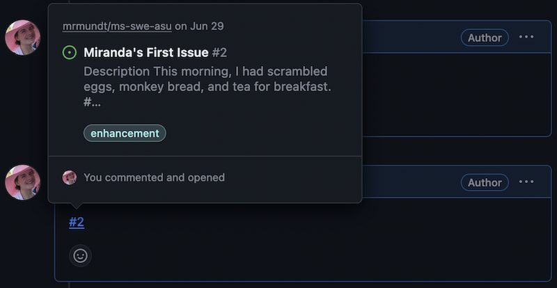

::::::::::::::::::::::::::::::::::::::: objectives

- Become familiar with basic actions on GitHub Pull Requests.

::::::::::::::::::::::::::::::::::::::::::::::::::

:::::::::::::::::::::::::::::::::::::::: questions

- How do you open a PR?
- How do you interact with a PR?
- How do you merge a PR?

::::::::::::::::::::::::::::::::::::::::::::::::::

## Open a PR

A PR cannot be opened without some changes to be incorporated. For this example,
we will use the `branch` and `merge` workflow; however, another common method
is the `fork`, `branch`, and `merge` method.

:::::::::::::::::::::::::::::::::::::::::  callout

## Multiple Paths Available

We will do the rest of this lesson through the GUI; however, all of these
steps can be done via command line and your preferred text editor.
Do whatever feels right for you!

::::::::::::::::::::::::::::::::::::::::::::::::::

### Make a Change

First we will make a change to a file in our repository. We click on the
preferred file in the repository and hit the "Edit" pencil in the top-right
corner.

{alt='On a README file, the File edit button in the top-right is highlighted'}

Once the file is edited to our satisfaction, we click "Commit changes...",
which pops up a dialog box asking us to fill in the commit message.

{alt='Commit changes pop-up dialog with the sections Commit message, Extended commit message, and the radio option for "Commit directly to `main`" or "Create a new branch" circled'}

Rather than committing directly to the main branch, we will instead make a
new branch with the changes.

{alt='Commit changes pop-up dialog, zoomed in on the "Create a new branch" radio button when clicked, which defaults a branch name that can be changed'}

GitHub will autopopulate a branch name for us. We can choose to keep it or
change it.

### Make a PR

Once we click "Commit changes," the page will load the "Open a pull request"
page with our commit message as the title.

{alt='Open a pull request page loaded - shows the commit message from the previous step as the Title, empty "Write" section'}

A new PR has several parts:

- _Title_: This will display on the main "Pull request" page.
- _Write_: This is an open area for the details of the PR. GitHub support Markdown formatting.
- _Preview_: This will preview the Markdown-rendered version of the details.

To open the issue, click the "Create pull request" button.

{alt='Newly opened PR with proposed changes - main page shows the Title, description, list of commits, and merge options'}

:::::::::::::::::::::::::::::::::::::::  challenge

## Open a New PR

Navigate to your practice repository.
 
* Make a change to your `README.md` file
* Commit the changes to a new branch
* Put a basic title and details
* Create the PR

::::::::::::::::::::::::::::::::::::::::::::::::::

## Interact with a PR

There are many interactions available on an open PR.

The most basic interaction is adding a comment. This is
how you can interact with the PR author, the assignee, and others who
have commented on or subscribed to the PR.

Simply click in the comment box at the bottom of the PR, type whatever
you'd like, and click "Comment."

{alt='Comment box on a Pull Request - Write section includes a statement, "I am writing a comment on this PR"'}

Another useful feature for GitHub is linking Issues and PRs. This is actually
very simple. In the PR's description or in a comment, mention the relevant
Issue using `#` and the Issue number.

{alt='An image using the pound symbol (#) to pop-up options for linking other Issues or Pull Requests'}

This will create a link to the Issue.

{alt='An image showing the pop-up to a linked issue. The pop-up shows a small preview of the linked issue that includes the title and some portion of the description.'}

You can also edit the information in the right-hand column.

{alt='Information block on the right-hand side that includes reviewers, assignees, labels, projects'}

We will cover the following options:

| Options | Purpose |
| ------- | ------- |
| Reviewers | Assign reviewer(s) to look over your proposed changes. |
| Assignees | Add assignee(s) who are responsible for incorporating proposed changes. |
| Labels | Assign label(s) to categorize the PR. |

:::::::::::::::::::::::::::::::::::::::  challenge

## Assignment Time

Navigate to your PR from the previous exercise.
 
* Add yourself as the `Assignee`
* Mention one of your open Issues

::::::::::::::::::::::::::::::::::::::::::::::::::

## Merge a PR

We are done with these changes. We have completed the work on it, had our
discussion, and now we are ready to merge the changes.

:::::::::::::::::::::::::::::::::::::::::  callout

## Wait, what about review?

Nobody reviewed our changes, so do we really want to merge? In a real-case
scenario, *no*! We will cover more about reviewing later, though, so we
are going to skip it for now.

::::::::::::::::::::::::::::::::::::::::::::::::::

Merging a PR is quite simple - just click the "Merge pull request" button.

{alt='The merge options on the example PR that shows that the branch has no conflicts and the "Merge pull request" button highlighted'}

The dropdown on the "Merge pull request" shows several options:

{alt='Merge PR dropdown with three options - Create a merge commit, Squash and merge, Rebase and merge'}

We will not cover all of these options here, but read more about them in
[GitHub's official documentation](https://docs.github.com/en/pull-requests/collaborating-with-pull-requests/incorporating-changes-from-a-pull-request/merging-a-pull-request#merging-a-pull-request).

When you click the "Merge pull request" button, a new dialog box appears,
prompting for the commit message. Once you have made the preferred edits,
click "Confirm merge."

{alt='Confirm merge dialog box - shows the merge commit message, an extended message, and a button to confirm the merge'}

The changes have been incorporated back into the `main` branch.

:::::::::::::::::::::::::::::::::::::::  challenge

## Time to Merge

Navigate to your PR from the previous exercises.
 
* Click "Merge pull request"
* Modify the merge message
* Merge!

::::::::::::::::::::::::::::::::::::::::::::::::::

You now know the basic actions you can take on a GitHub Pull Request!

:::::::::::::::::::::::::::::::::::::::: keypoints

- New PRs can be opened in a repository from a branch or a fork.
- Text on PRs use Markdown styling for formatting.
- A user can interact with PRs in multiple ways: commenting, assigning reviewers, linking to other issues and pull requests, and more.

::::::::::::::::::::::::::::::::::::::::::::::::::
