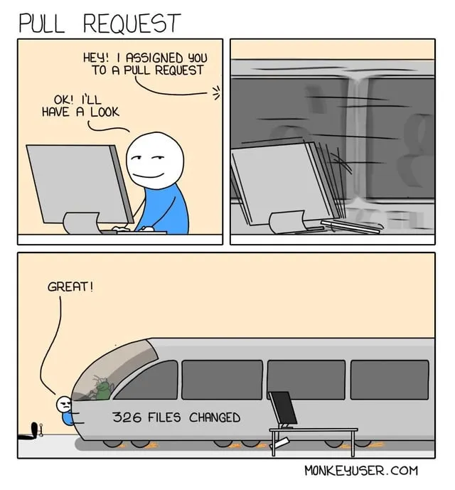

::::::::::::::::::::::::::::::::::::::: objectives

- Recall the characteristics of a good pull request.
- Practice diagnosing and fixing problematic PRs.

::::::::::::::::::::::::::::::::::::::::::::::::::

:::::::::::::::::::::::::::::::::::::::: questions

- What does it mean to be a 'good' PR?
- How do you fix a PR that breaks the rules?

::::::::::::::::::::::::::::::::::::::::::::::::::

## Recap: the Characteristics of a Good PR

You met these when you opened your StarSort PR. Here they are in one place:

| Characteristic | The short version |
|-------|-------------------|
| **One cohesive change** | One PR = one logical thing. (This is the *single-responsibility* idea: a unit should answer to one purpose.) |
| **Reasonable size** | Small PRs get reviewed faster and more carefully. Split big ones. |
| **What / how / why** | The description says what changed, how (incl. side effects), and why. |

None of these are absolute rules — but a PR that follows all three is a gift to whoever reviews
it (often future you).

{alt='A three-pane comic depicting a person being asked to review a PR, then that person is hit by a train that has the words "326 files changed" on the side of it.'}

## Now You're the Reviewer

Knowing the habits is one thing; *spotting* where they're broken is the real skill. Let's
practice on a few PRs that just landed in StarSort's queue.

:::::::::::::::::::::::::::::::::::::::  challenge

## Spot the Problem

For each PR below, name what's wrong and what you'd ask the author to do.

1. **PR #41 — "updates"** — changes 14 files: fixes the empty-folder crash, renames a function
   used across the codebase, *and* adds a brand-new export feature. Description is blank.
2. **PR #42 — "fix"** — a one-line bugfix. Title is just "fix"; no description.
3. **PR #43 — "Refactor everything before the release"** — 2,300 changed lines across 60 files,
   with the description: "cleaned things up."

:::::::::::::::::::::: solution

1. **Does too many things at once** (violates one-cohesive-change) *and* has no description.
   Ask the author to split it into three PRs — bugfix, rename, feature — each described.
2. **Not descriptive.** The change may be fine, but "fix" tells a reviewer nothing. Ask for a
   real title and a one-line *what/why* (e.g., "Fix off-by-one in image index that skipped the
   last file").
3. **Too big** *and* **vague**. A 2,300-line "cleanup" is nearly unreviewable. Ask the author to
   break it into focused PRs (one refactor per PR) with descriptions of what and why.

::::::::::::::::::::::

::::::::::::::::::::::::::::::::::::::::::::::::::

::::::::::::::::::::::::::::::::::::::::::  callout

## GenAI: A first-pass reviewer (with limits)

LLMs can give a PR a quick first look — flag style issues, summarize a huge diff so a human
reviewer knows where to focus, or suggest a clearer description. But they have real limits: they
miss project **intent and context**, can be **confidently wrong**, and don't carry
accountability. Use AI to *prepare* a review, not to *make a decision* — a human still owns the
decision to merge. (And for research code, check data/IP policy before pasting a private diff
into a third-party tool.)

::::::::::::::::::::::::::::::::::::::::::::::::::::::

:::::::::::::::::::::::::::::::::::::::: keypoints

- A pull request should contain _ONE_ cohesive change.
- A pull request should, ideally, be quickly reviewable.
- A pull request description should give an overview of what, how, and why something changed.
- Diagnosing an oversized, unfocused, or undescribed PR is a core reviewer skill.
- GenAI can assist a review (summaries, first pass) but the human owns the merge decision.

::::::::::::::::::::::::::::::::::::::::::::::::::
