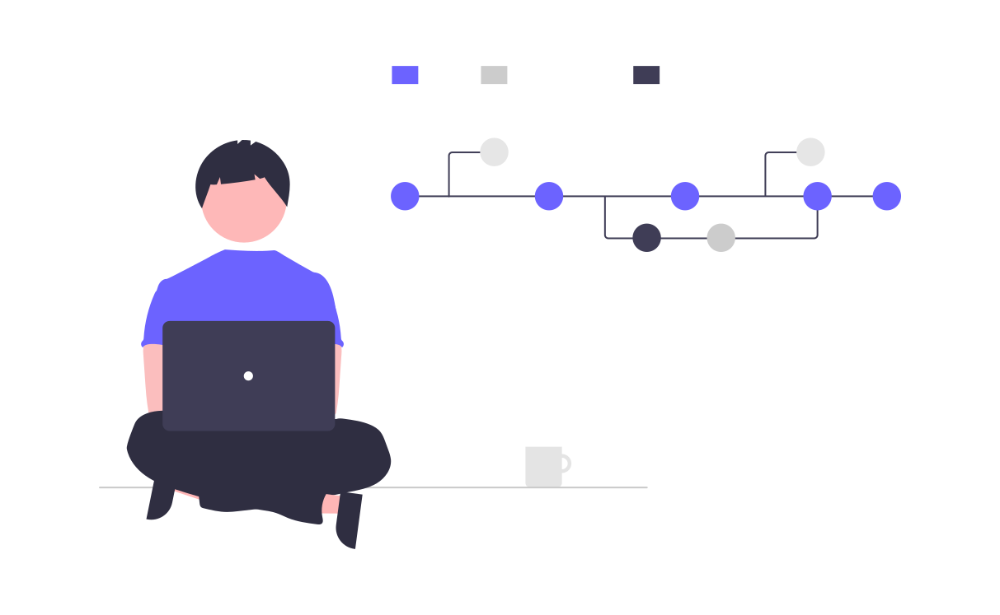
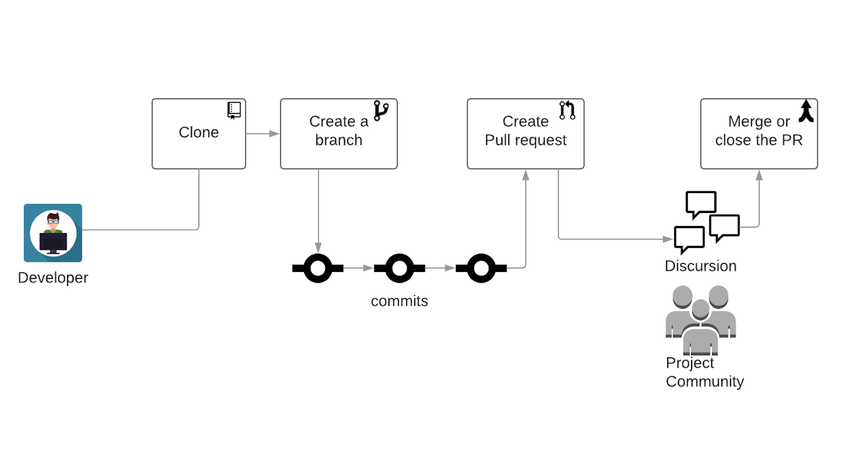

::::::::::::::::::::::::::::::::::::::: objectives

- Become familiar with the purpose of PRs.

::::::::::::::::::::::::::::::::::::::::::::::::::

:::::::::::::::::::::::::::::::::::::::: questions

- What are Pull Requests (PRs)?
- How do PRs help with software development?

::::::::::::::::::::::::::::::::::::::::::::::::::

## What are Pull Requests?

To borrow from Rachel Garner, "Software developers use pull requests, otherwise
known as PR, to initiate the process of integrating new code changes into the
main project repository. Pull requests are sent through git systems, like
GitLab, GitHub, and BitBucket, to notify the rest of your team that a branch
or fork is ready to be reviewed."

{alt='Decorative image from Undraw.co to visualize a version control pipeline'}

In other words, PRs are a mechanism for introducing and merging changes
into a code base in a manner that enables discussion and collaboration.

In this lesson, students will learn about better practices for GitHub PRs.

::::::::::::::::::::::::::::::::::::::::::  callout

## Back to the StarSort team!

Remember **StarSort**, the (fictional) telescope-image tool from the Issue Tracking lesson?
Last time, you filed a bug report. Today you get to **fix it** — you'll open a pull request with
the fix, get it reviewed by a teammate, and merge it in. That's the full contributor loop.

(As before, everything happens in **your own practice repository** — StarSort is just the story.
Didn't do the Issues lesson? No problem: anywhere we say "fix the StarSort bug," just make a
small change to your `README.md` instead.)

::::::::::::::::::::::::::::::::::::::::::::::::::::::

::::::::::::::::::::::::::::::::::::::::::  callout

## Where does genAI fit?

Generative AI (LLMs like ChatGPT and Claude) is genuinely useful around PRs: drafting a clear
description from your diff, generating a PR template, summarizing a giant changeset for a
reviewer, even doing a first-pass review. We'll flag the most useful spots — with the usual catch:
**AI drafts, you review.**

::::::::::::::::::::::::::::::::::::::::::::::::::::::

## How Pull Requests Fit in the Development Process

{alt='From Freira et al.: Visualization of the GitHub development workflow with PRs. Workflow goes from Developer to Clone to Create a Branch to individual commits to Create Pull Request to Discussion/Project Community, ending with Merge or close the PR'}

The development workflow can have several different formats; however, a simple
one is this:

1. Create a feature branch
1. Make changes and commit back to the feature branch
1. Open a Pull request

## The Benefits of Pull Requests

Why route changes through a PR instead of committing straight to `main`?

| Benefit | What it gives you |
|---------|-------------------|
| **Collaboration** | A place for others to see and comment on proposed changes before they land. |
| **Reduced risk** | Teammates can catch bugs, regressions, and risky choices early. |
| **Higher quality** | No one person knows everything — a second set of eyes improves the code. |

## GitHub Pull Requests

GitHub builds branching and merging right into version control: every project can use the
**Pull requests** tab in the repository navigation bar to open, discuss, and merge PRs.

{alt='INTERSECT training repository navigation bar, showing, from left to right: Code, Issues, Pull Requests, Actions, Projects, Security, Insights'}

:::::::::::::::::::::::::::::::::::::::  challenge

## Browsing Open PRs

Let's peek at a real project's PR queue. Navigate to
[https://github.com/spack/spack](https://github.com/spack/spack) and find the pull requests
page.

* How many PRs are currently open?
* How many have been closed?
* Who is the author of the top-most PR?

:::::::::::::::::::::: solution

Open/closed counts are the toggles at the top of the PR list; the top PR's author is shown right
under its title. Numbers change constantly — a busy project like spack merges PRs all day long.

::::::::::::::::::::::

::::::::::::::::::::::::::::::::::::::::::::::::::

:::::::::::::::::::::::::::::::::::::::: keypoints

- Pull Requests are a way to control the introduction of new content into a shared repository.
- Pull Requests enable better collaboration for multiple developers.

::::::::::::::::::::::::::::::::::::::::::::::::::
