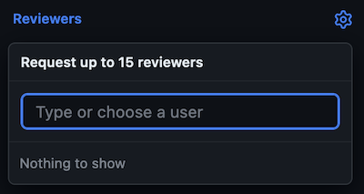
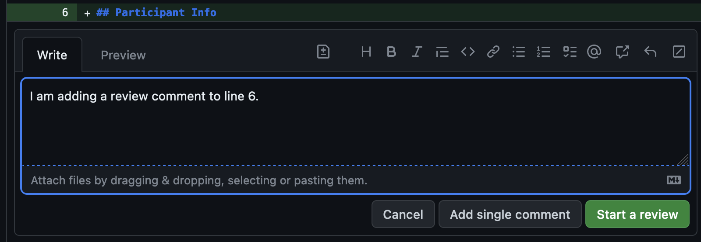
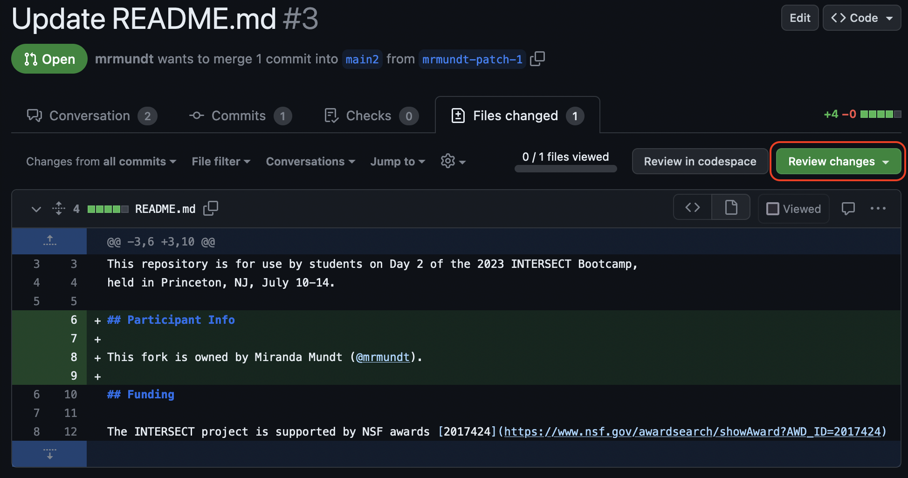
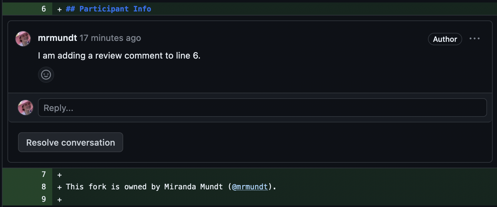

::::::::::::::::::::::::::::::::::::::: objectives

- Become familiar with the code review process on GitHub.

::::::::::::::::::::::::::::::::::::::::::::::::::

:::::::::::::::::::::::::::::::::::::::: questions

- How do you add reviews to a PR?
- How do you address requested changes?

::::::::::::::::::::::::::::::::::::::::::::::::::

## Request a Review

Requesting a review can be done within a PR. Click on a PR, then click on 
"Reviewers" on the right-hand side. Here you can type in and select
reviewers for your PR.

{alt='Reviewers menu on a Pull Request - includes the text "Select up to 15 reviewers" and a search bar in which a user can start type a GitHub handle'}

:::::::::::::::::::::::::::::::::::::::::  callout

## No reviewers?

At this point, likely no reviewers will appear. You can only directly request
reviews from "Collaborators" on your repository.

::::::::::::::::::::::::::::::::::::::::::::::::::

## Add a Review

To add a review to a PR, navigate to the PR in question and click on "Files
changed."

{alt='The Pull Request main page with the "Files Changed" tab (far-right option) circled'}

Within this page, when you hover over a line of text, a `+` button will appear
to the left.

{alt='Small example of what the plus (+) symbol looks like for adding comments to a specific line on a PR'}

Click on the `+` button to add a comment to that line.

{alt='The pop-up dialog to add a comment on Line 6 - includes a Write and Preview section plus buttons to Cancel, Add single comment, and Start a review'}

At this point, you can "Cancel", "Add single comment", or "Start a review." If
you click "Add single comment", the comment will be added without rendering
a review decision. If you click "Start a review", this will "start" a review.

:::::::::::::::::::::::::::::::::::::::::  callout

## Can you see it yet?

At this point, no one can see your review. It is "Pending" until you finish
all of your comments.

::::::::::::::::::::::::::::::::::::::::::::::::::

Once you have finished adding all of the comments, you will need to press the
"Review changes" button.

{alt='Files changed page with review button highlighted'}

You will see three options: "Comment", "Approve", or "Request changes."

:::::::::::::::::::::::::::::::::::::::::  callout

## Greyed out options?

Are you following along on your own PR? You might notice that you cannot
approve or request changes. This is because you are the author! GitHub
doesn't allow authors to do either of these actions.

::::::::::::::::::::::::::::::::::::::::::::::::::

:::::::::::::::::::::::::::::::::::::::  challenge

## Let's Review

Partner up with another participant and navigate to their practice repository.
Add a few comments to one of their PRs and submit the review, requesting changes.

::::::::::::::::::::::::::::::::::::::::::::::::::

## Address a Review

Review comments can be viewed in the "Conversation" tab as well as in the
"Files changed" tab. 

{alt='An image displaying the main Pull request page (Conversation), on which the review comments appear lumped together with a preview of each line/comment in its own box'}

{alt='An image displaying the Files changed page, on which the review comments appear on each line on which they were added'}

Incorporating requested changes can be done via command line or through the
GitHub GUI. Once addressed and pushed, you can resolved the different conversations
and re-request a review.

:::::::::::::::::::::::::::::::::::::::  challenge

## Fix It

Address the changes your partner requested and re-request a review from them.

::::::::::::::::::::::::::::::::::::::::::::::::::

And that’s all, folks! You now know much more about GitHub Pull Requests.

:::::::::::::::::::::::::::::::::::::::: keypoints

- Code reviews are integrated into GitHub Pull requests.
- Reviewers can approve, request changes, or simply add comments as part of the review process.

::::::::::::::::::::::::::::::::::::::::::::::::::
